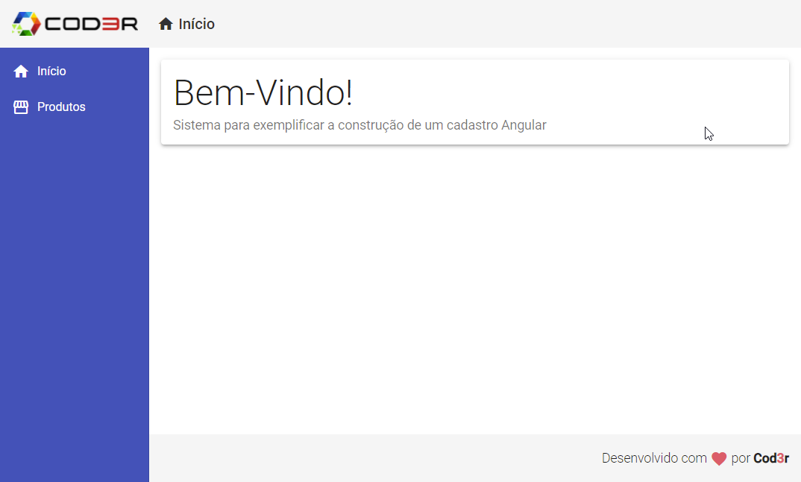

# Angular Simple CRUD Project

Simple and basic CRUD project in Angular for training and studying purposes.

## Backend

Simples JSON DB, to be used with json-server and node.

1. Install packages and dependencies with `npm i`;
2. Run with `npm start`
3. API's URL: `http://localhost:3001/`

## Frontend

Simple CRUD app for product list, made with Angular 13.2.4.

1. Install packages and dependencies with `npm i`;
2. Run with `ng serve`
3. URL: `http://localhost:4200/`

## Preview

